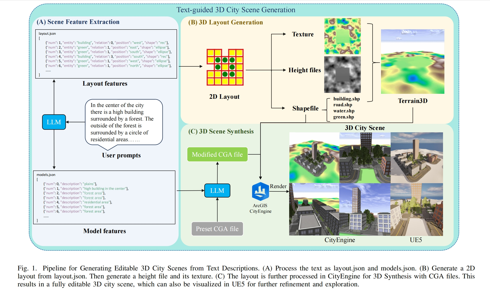
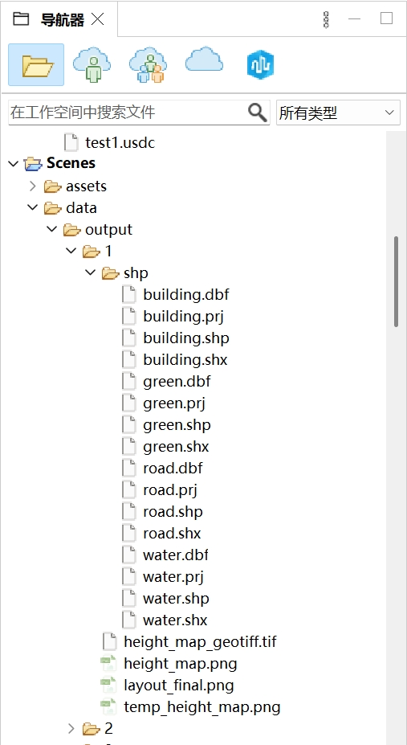
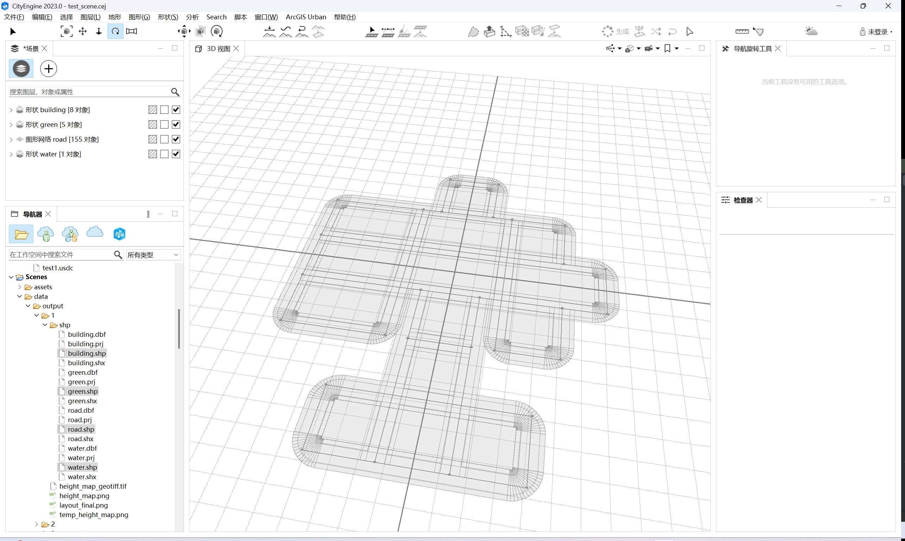
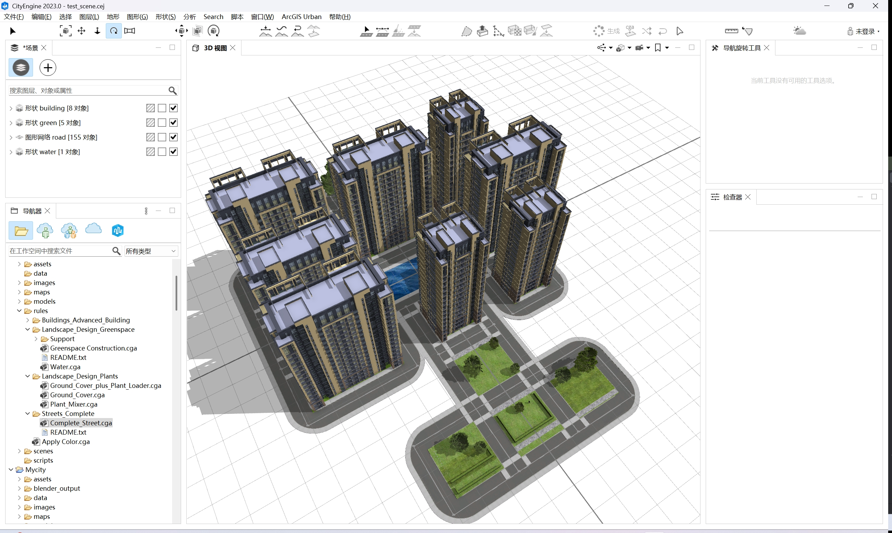
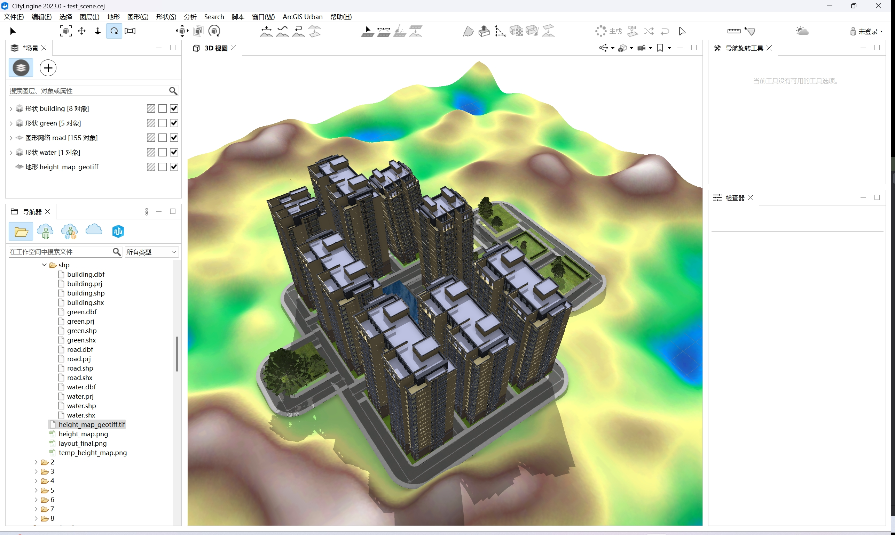

# Text-Guided Editable 3D City Scene Generation



## 环境配置

### 1. 安装Anaconda

### 2. 创建虚拟环境
```bash
conda create -n city_layout python=3.10
conda activate city_layout
```

### 3. 安装系统依赖（Linux/macOS）
```bash
# Ubuntu/Debian
sudo apt-get install -y gdal-bin libgdal-dev

# macOS (Homebrew)
brew install gdal
```

### 4. 安装Python依赖
```bash
# 使用pip
pip install -r requirements.txt

# 或使用conda（部分依赖）
conda install -c conda-forge gdal pyproj rasterio
pip install -r requirements.txt
```
### 5.安装CityEngine（2023.0及以上）

## 🏃 运行流程（需要手动打开CityEngine生成渲染）
### 1. 准备输入文件
在项目根目录创建 dspt.txt，表示用户输入的文本描述，内容示例：
```txt
In the center of the city there is a high building surrounded by a forest. The outside of the forest is surrounded by a circle of residential areas.
```

### 2. 执行主程序
```bash
python text-json.py
```
注意：Deepseek的接口调用可能会因为网络波动较慢，请耐心等待。如报错出现HTTPError，请重新运行此程序。

### 3. 得到layout相关输出结果
```txt
生成文件列表：

├── layout.json        # 布局配置文件
├── models.json        # 模型特征文件
├── layout_final.png   # 布局可视化
├── height_map.png     # 高度图
├── height_map_geotiff.tif  # 地理参考高度图
└── shp/               # Shapefile矢量文件
    ├── building.shp
    ├── green.shp
    ├── water.shp
    └── road.shp
```

### 4. 导入CityEngine生成三维场景
#### （1）首先需要将所有文件拷贝至CityEngine的workspace中
默认路径为：
```txt
C:\Users\Documents\CityEngine\Default Workspace
```


#### （2）创建一个新的Scene，导入shapefile文件
将shp文件拖拽到场景的3D视图中，可以根据默认设置直接导入



#### （3）利用CGA规则进行生成
将选好的CGA文件拖拽到对应的地块上即可



#### （4）导入地形，并投影

##### a.选择height_map_geotiff.tif 右键导入，选择对应的height_map.png作为贴图，400*400大小比例。
##### b.先选中所有对象，右键选择将形状与地形对齐。再单独选择所有道路，选择“图形”选项下的“将图形与地形对齐”。将上一步渲染的图形将建筑道路等形状投影到此地形上。
##### c.最后选择“地形”选项下的“将地形与形状对齐”，进行细节的微调。



#### （5）导出场景文件，方便后续进一步渲染和优化
目前CityEngine支持的导出格式如下


## 📁 项目结构
```txt
city-layout/
├── text-json.py        # 主程序
├── layout_gen.py       # 布局生成器
├── dspt.txt            # 输入描述文件
├── requirements.txt    # 依赖清单
├── images              # 示例图片
├── cga_example         # CGA示例规则
└── README.md           # 本指引文件

```
